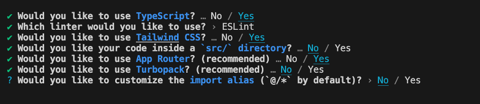
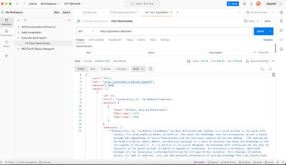

# gutendex-book-search
This displays book information fetched from the Gutendex API.

I decided to use Next.js in creeting this application due to Alex informing me that NLPatent uses Next.js. Although I had not used Next.js before this, I beleived this would be good practice so I decided to take on the challenge.

First I went through a YouTube tutorial on Next and how it works. I then began in setting up the Next App. 

I ran Npm run dev to confirm the Next.JS app is running and this is where I have been observing the UI changes.

Decisions on UI:
- Library background image for fitting web app purpose.
- Intentional simple colours in consideration of those who are colour blind allowing for easy reading.
- Only displaying a few books per row to allow for better readability and not to overwhelm users
- Form and books on same page, this allows users to scroll easily and submit a new search

The first new learning I came across was that the page name needs to be called page.tsx but the page is referenced through its directory name.

I then realised when using hooks, I must have ‘use client’ at the top of the page as hooks cannot be used inside server components. So this statement makes the page use a Client component.

When building the UI I decided to use the Schadcn compoinent library.

I then came into an issue where I found out when using a <Select.Item /> component, each item must have a value prop that isn't an empty string "". This allows you to clear the selection.

I then tested the API from gutendex.com using Postman.

I decided not to use any API keys as the gutendex API is a public API, if it was a private API, I would use API keys and utilise the gitignore file.

After creating the form and the bookResults seperately, I change the book search so that the form is calling the books directly. i did this by adding a useState to store the books.

Initially the form was only working on one submit, didn’t allow for a second submit, so I added a useEffect hook to fix this.

My initial implementation of the Languages query wasn’t working as part of the search, so I added this line:

`const languageQuery = languages.length > 0 ? ``&languages=${languages.join(',')}' : '';`

This mimics the query for the languages correctly. It checks if there is a language query and add it onto the original query to the API.

I then noticed that the original implementation I had of the pagination wasn't working. This was because I made it originally in the bookResults component, the nextURL and prevURL component props were not being passed correctly to the form. I then modified this. 

I was having issues with Jest unit testing to be visible because of typescript compiler:
https://github.com/testing-library/jest-dom/issues/546

this helped but also followed a youtube tutorial on setting up the enviornment here:
https://www.youtube.com/watch?v=AS79oJ3Fcf0

While continuing to improve the application layout. I moved the types to a seperate file to improve the maintainability of the application.

While conducting the unit testing, I also came across an issue that was stopping components from being rendered. I found that Jest doesn't recongise component libraries like Schadcn, so I had to mock these calls.

Bugs that can be fixed to improve the application:
- Currently no message is given to the user when loading the information after pagination clicks
- Currently if the API call returns an empty array, there is no information being displayed to the user to say this
- Improve responsiveness
- background Image pixelation on search